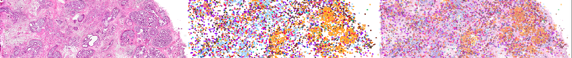

# Microscope images such as H&E images register to spatial transcripts or DNA images

A MATLAB-based tool for manually registering microscope images to spatial molecular data.

### Overview

MATLAB is a powerful tool for computer vision, offering numerous toolboxes such as the Registration Estimator, which includes several automated methods for image registration. While these techniques are effective in many scenarios, they often fall short when applied to H&E images and spatial transcriptomic data due to the complexity and variability of the images.

For cases where automated methods fail to produce satisfactory results, manual alignment becomes necessary. The scripts provided in this repository are specifically designed to help you manually register these images.

### Usage
    The repository is for technologies has no ready to use software to align H&E image to spatial transcripts such as merscope, trekker slide tag. 
    Experiment with the automated techniques available in the Registration Estimator toolbox.
    If none of the automated methods yield acceptable results, use the provided scripts for precise manual alignment.

    
% load the fixed (reference) image and moving image
% image can be resized if size has big differences

```r
fixedImage=imread('HE_resize.png')
movingImage=imread('RNA_map.png')

imshow(fixedImage)
imshow(movingImage)

% Display the images
figure;
subplot(1, 2, 1); imshow(fixedImage); title('Fixed Image');
subplot(1, 2, 2); imshow(movingImage); title('Moving Image')

% Convert to grayscale if the images are RGB
fixedGray = rgb2gray(fixedImage);
movingGray = rgb2gray(movingImage);

% Resize the moving image to match the fixed image (if required)
movingGray = imresize(movingGray, size(fixedGray));


subplot(1, 2, 1); imshow(fixedGray); title('Fixed Image');
subplot(1, 2, 2); imshow(movingGray); title('Moving Image')


% Open control point selection tool
[movingPoints, fixedPoints] = cpselect(movingGray, fixedGray, 'Wait', true);

% control point selection tool window will pop up, at least 3 or 4 pairs of poins should be seleted from the left and right
% window before close the window

% Estimate transformation
tform = fitgeotrans(movingPoints, fixedPoints, 'affine'); % Change 'affine' to other types if needed,Type of linear transformation, specified as "nonreflectivesimilarity", "similarity", "affine", or "projective"


%% grayimage

% Apply transformation to moving image
outputView = imref2d(size(fixedGray));
registeredImage = imwarp(movingGray, tform, 'OutputView', outputView);

% Display the result
figure;
imshowpair(fixedGray, registeredImage, 'blend');
title('Registered Image (Manual)');

%% color image

% Define output view to match the fixed image dimensions
outputView = imref2d(size(fixedImage));

% Apply the transformation
registeredImage = imwarp(movingImage, tform, 'OutputView', outputView);
% Display overlay of fixed and registered images figure;

imshowpair(fixedImage, registeredImage, 'blend');
title('Overlay of Fixed and Registered Color Images');

blendedImage = imfuse(fixedImage, registeredImage, 'blend')
montage({fixedImage,registeredImage,blendedImage},'Size',[1 3])




